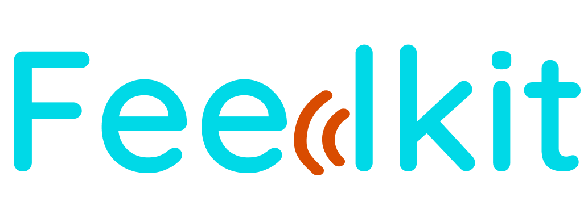

yourFeeds is a Backend API for realtime access to curated feed (news) posts, podcasts, etc. across numerous categories and many more based on user's preferences.

## Run Locally

Clone the project
```bash
  git clone project
```

Navigate to the project directory
```bash
  cd project
```

Install dependencies
```bash
  npm install
```

Start the server
```bash
  npm run dev
```

Create build files
```bash
npm run build
```

Typescript compile during development:
`tsc -w` and `npm run dev`

## Running Tests
To run tests, run the following command

```bash
  npm run test
```

## Documentation
[Documentation](https://feedkit.herokuapp.com/api-docs/)

## Tech Stack
**Server:** Node, Express, Typescript, SocketIO, MongoDB

**Advanced Message Queue Protocol:** RabbitMQ

**Caching:** Redis

**Containerization:** Docker

**Others:** Newrelic, Sentry, Snyk, papertail

## Authors
- [@gblend](https://www.github.com/gblend)

## 🔗 Links
[](https://gblend.tech/)
[](https://linkedin.com/in/gabriel-ilochi-75a237174/)
[](https://twitter.com/_gblend)
